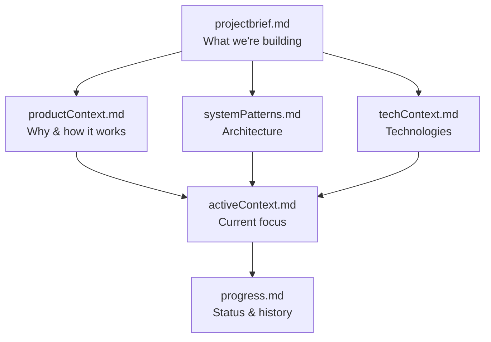

# Memory Bank - Amazon Associates Automated Reporting

This folder contains the **Cline Memory Bank** for this project - a structured documentation system that maintains context across AI sessions.

## What is the Memory Bank?

The Memory Bank is a methodology for managing AI context through structured documentation. When you instruct Cline (or another AI assistant) to "follow custom instructions" or "read memory bank", it rebuilds its understanding of your project from these files.

Reference: [Cline Memory Bank Documentation](https://docs.cline.bot/prompting/cline-memory-bank)

---

## File Structure

The Memory Bank uses a hierarchical structure where files build upon each other:

```
projectbrief.md (Foundation)
    ↓
    ├─ productContext.md (Why & What)
    ├─ systemPatterns.md (How - Architecture)
    └─ techContext.md (How - Technology)
    ↓
activeContext.md (Current State)
    ↓
progress.md (Status & History)
```

---

## Core Files

### 1. projectbrief.md
**Purpose:** Foundation document  
**Contains:**
- High-level project overview
- Core requirements and goals
- Technical approach
- Success criteria
- Current status

**When to update:** Rarely - only when project scope or goals change

### 2. productContext.md
**Purpose:** Product understanding  
**Contains:**
- Why this project exists
- Problems being solved
- How it should work
- User experience goals
- Design principles

**When to update:** When product direction changes or new insights emerge

### 3. activeContext.md
**Purpose:** Current work focus  
**Contains:**
- Current work focus and blockers
- Recent changes
- Next steps
- Active decisions
- Important patterns discovered
- Context for AI to continue work

**When to update:** Frequently - after significant work sessions

### 4. systemPatterns.md
**Purpose:** Technical architecture  
**Contains:**
- System architecture diagrams
- Key technical decisions
- Design patterns in use
- Component relationships
- Critical implementation paths

**When to update:** When architecture changes or new patterns emerge

### 5. techContext.md
**Purpose:** Technology details  
**Contains:**
- Technologies and frameworks used
- Development setup instructions
- Technical constraints
- Dependencies and tools
- API references

**When to update:** When adding/changing technologies or setup procedures

### 6. progress.md
**Purpose:** Project status  
**Contains:**
- What's complete
- What's pending
- Known issues
- Timeline and milestones
- Metrics
- Evolution of decisions

**When to update:** After completing milestones or when status changes

---

## How to Use with Cline

### Starting a New Session

When you open Cline for this project:

1. **Tell Cline to read the Memory Bank:**
   ```
   "Follow your custom instructions and review the memory bank"
   ```
   Or simply:
   ```
   "Read memory bank and continue where we left off"
   ```

2. **Cline will:**
   - Read all memory bank files
   - Understand current project state
   - Know what's complete and what's pending
   - Recognize any blockers
   - Continue work seamlessly

### During Active Work

**Automatic Updates:**
- Cline will update memory bank files as patterns emerge
- Focus is on `activeContext.md` and `progress.md`

**Manual Updates:**
- Request updates with: `"Update memory bank"`
- Cline will review ALL files and update as needed

**When to Request Updates:**
- After completing significant features
- When discovering new patterns
- Before ending a long session
- When project direction changes

### Context Window Management

When Cline's context window fills up:

1. Say: `"Update memory bank"` (captures current state)
2. Start a new chat/task
3. Say: `"Follow your custom instructions"` (loads memory bank)

This preserves context across sessions without losing information.

---

## Best Practices

### For AI Assistants

When working with this project:

1. **Always start by reading ALL memory bank files** (especially projectbrief.md and activeContext.md)
2. **Check progress.md** to see what's complete vs. pending
3. **Review systemPatterns.md** before making architectural changes
4. **Update activeContext.md** when discovering new patterns or insights
5. **Update progress.md** when completing tasks or encountering blockers

### For Humans

When maintaining this project:

1. **Review activeContext.md** to understand current state
2. **Check progress.md** for status and known issues
3. **Update files** when you make significant changes manually
4. **Keep files current** - stale memory bank is worse than none

---

## File Relationships



**Read Order for New Contributors:**
1. projectbrief.md (foundation)
2. productContext.md (understand the why)
3. systemPatterns.md (understand the how)
4. activeContext.md (current state)
5. progress.md (what's done/pending)
6. techContext.md (technical details as needed)

---

## Current Project Status

**Phase:** Implementation Complete, Pre-Deployment  
**Critical Blocker:** Selector updates required  
**Next Steps:** User must inspect Amazon dashboard and update config.js

See `activeContext.md` and `progress.md` for detailed status.

---

## Quick Commands

**For Cline Users:**

```bash
# Start new session
"Follow your custom instructions"

# Update memory bank
"Update memory bank"

# Continue work
"Read activeContext.md and continue"

# Check status
"What's the current status according to progress.md?"
```

---

## Maintenance

### Regular Updates

**Daily (during active development):**
- Update `activeContext.md` with current focus
- Update `progress.md` when completing tasks

**Weekly:**
- Review all files for accuracy
- Update `progress.md` with milestone completion

**Monthly:**
- Deep review of all files
- Archive old context if needed
- Update technical decisions if changed

### Quality Checks

**Good Memory Bank:**
- ✅ Files are current and accurate
- ✅ Context is clear and specific
- ✅ Next steps are well-defined
- ✅ Blockers are clearly identified
- ✅ Decisions are documented with rationale

**Poor Memory Bank:**
- ❌ Outdated information
- ❌ Vague or generic content
- ❌ Missing critical context
- ❌ No clear next steps
- ❌ Undocumented decisions

---

## Related Documentation

- **Project Documentation:** `../docs/` folder
- **Setup Guide:** `../QUICKSTART.md`
- **Code:** `../src/` folder
- **Cline Memory Bank Docs:** https://docs.cline.bot/prompting/cline-memory-bank

---

## Notes

- Memory Bank files are **markdown** (not hidden system files)
- They're **version controlled** (commit them to git)
- They're **designed for both humans and AI** to read
- They **complement** (not replace) other documentation

---

**Last Updated:** November 3, 2025  
**Status:** ✅ Complete and current

